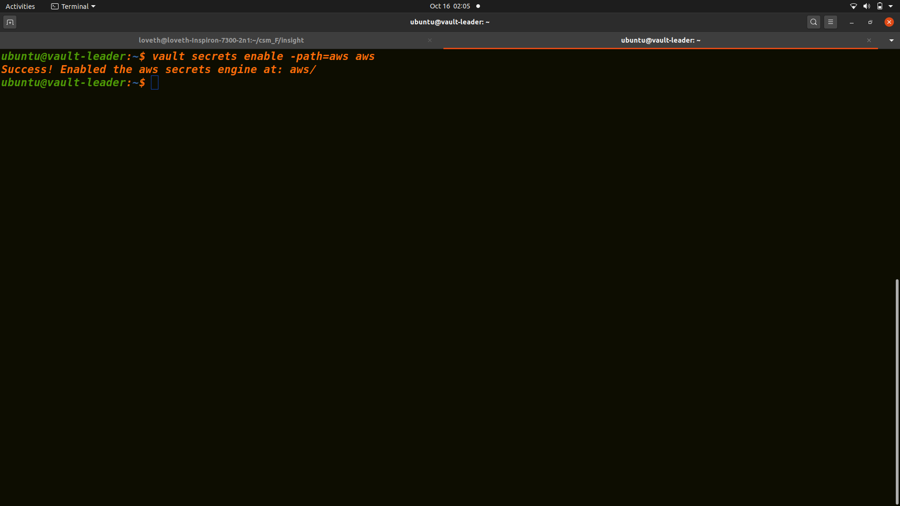
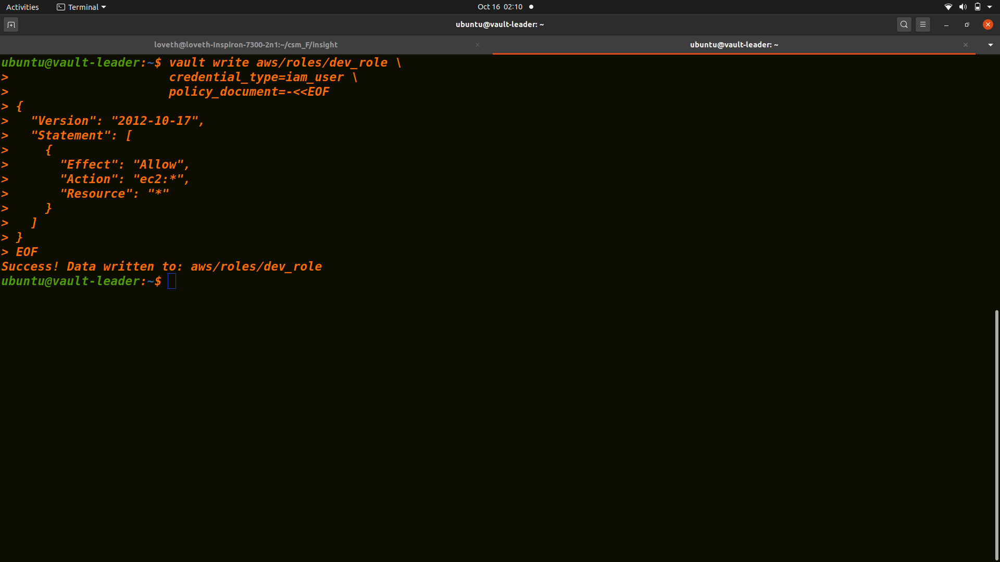
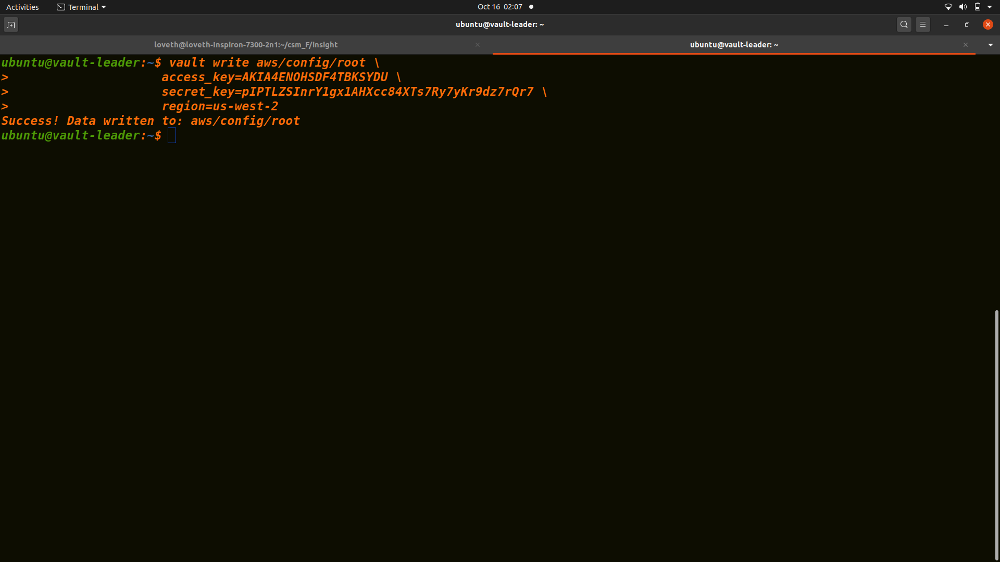

# Admin Workspace

The Admin is responsible for configuring the [AWS Secrets Engine](https://www.vaultproject.io/docs/secrets/aws/index.html) in Vault and defining the policy scope for the AWS credentials dynamically generated.

The "Admin" is generally concerned about managing the static and long lived AWS IAM credentials with varying scope required for developers to provision infrastructure in AWS.

## Inputs

| Name                          | Description                                    | Type     | Required |
| ----------------------------- | ---------------------------------------------- | -------- | -------- |
| VAULT_ADDR                    | Elastic Load Balancer address of Vault Cluster | `string` | yes      |
| VAULT_TOKEN                   | Vault root token                               | `string` | yes      |
| userpass_default_lease_ttl    | Userpass auth default lease ttl                | `string` | no       |
| userpass_max_lease_ttl        | Userpass auth max lease ttl                    | `string` | no       |
| aws_default_lease_ttl_seconds | AWS secret backend default lease ttl           | `string` | no       |
| aws_max_lease_ttl_seconds     | AWS secret backend max lease ttl               | `string` | no       |
| aws_profile                   | AWS profile saved in awscli                    | `string` | no       |
| name                          | name of aws secret backend role and path       | `string` | no       |

## Usage

## Enabline aws secret engine

## Creating role

## configuring aws

##  Author

Managed by [Loveth Oballe](https://github.com/oballe1)
